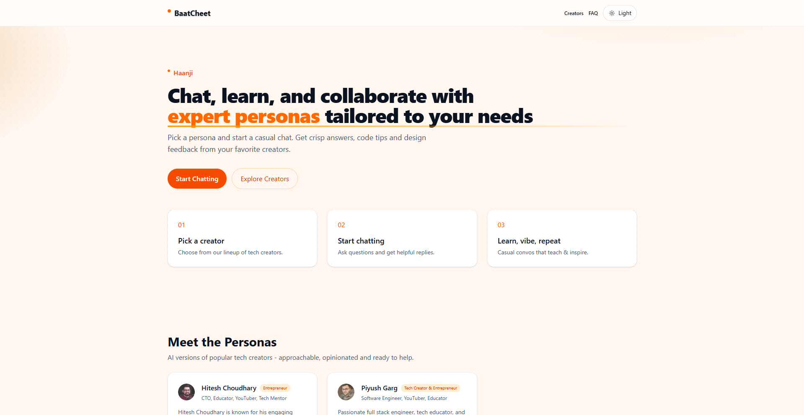

# **BaatCheet** — AI Personas Chat



Chat with AI personas of your favorite tech creators. Built with Next.js App Router, Tailwind CSS, and the Vercel AI SDK.

### Features
- Next.js 15 (App Router) + React 19
- Tailwind CSS v4 and dark/light theme toggle with no-FoUC init
- Landing page with animated sections and responsive CTAs
- Personas grid; “Chat Now” routes to `/chat?persona=<id>`
- Themed chat UI with streaming via `@ai-sdk/react` `useChat`
- Typing indicator during streaming
- Smart auto-scroll
- Markdown (GFM) rendering; links open in a new tab
- Syntax highlighting (highlight.js GitHub theme)
- Copy-to-clipboard button on code blocks

## Quickstart

Prerequisites:
- Node.js 18+ (or 20+)
- pnpm 9+

Install and run:
```bash
pnpm install
pnpm dev
```
Open http://localhost:3000

Production build:
```bash
pnpm build
pnpm start
```

## Environment
Create a `.env.local` at the project root. Common variables:
```
GOOGLE_GENERATIVE_AI_API_KEY=your-google-api-key
```
```ini
# Used for absolute Open Graph URLs and canonical tags
NEXT_PUBLIC_SITE_URL=http://localhost:3000
```

## Social preview (OG/Twitter)
- Global metadata is configured in `app/layout.tsx`.
- We use `public/og_image.png` as the Open Graph and Twitter image.
- To replace the preview image, add your file to `public/og_image.png` (recommended size 1200×630).

## Project structure (high-level)
- `app/` — App Router pages, layout, global styles
- `components/` — UI components (Navbar, Hero, Personas, Chat, etc.)
- `lib/` — data and utilities
- `public/` — static assets, including `og_image.png`

## Chat UX details
- Streaming: Messages stream in via the Vercel AI SDK. A typing indicator appears for the assistant while streaming.
- Auto-scroll: The view auto-scrolls only when within ~100px of the bottom. If you scroll up, auto-scroll pauses until you return near the bottom.
- Markdown: GFM enabled (tables, lists, task items). External links open in a new tab.
- Code: Highlighted with highlight.js (GitHub theme) and a Copy button on each block.

## Deploy
- Vercel is recommended. Ensure environment variables (like `NEXT_PUBLIC_SITE_URL` and provider API keys) are configured in your hosting dashboard.

---

Made with Next.js, Tailwind CSS, and the Vercel AI SDK.

### Made with ❤️ by Piyush